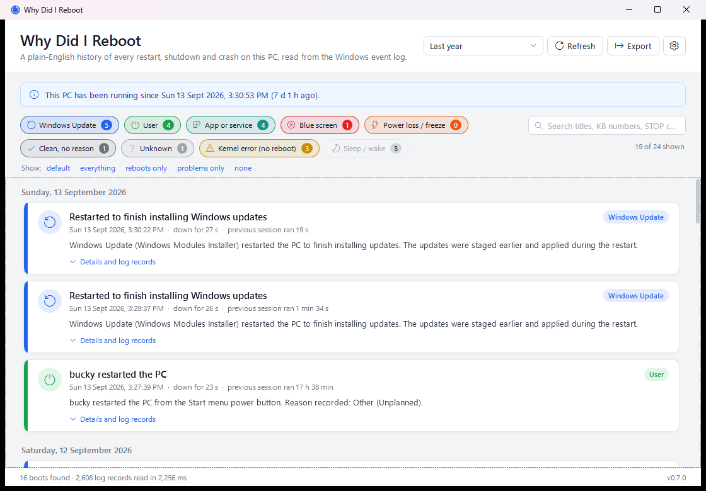
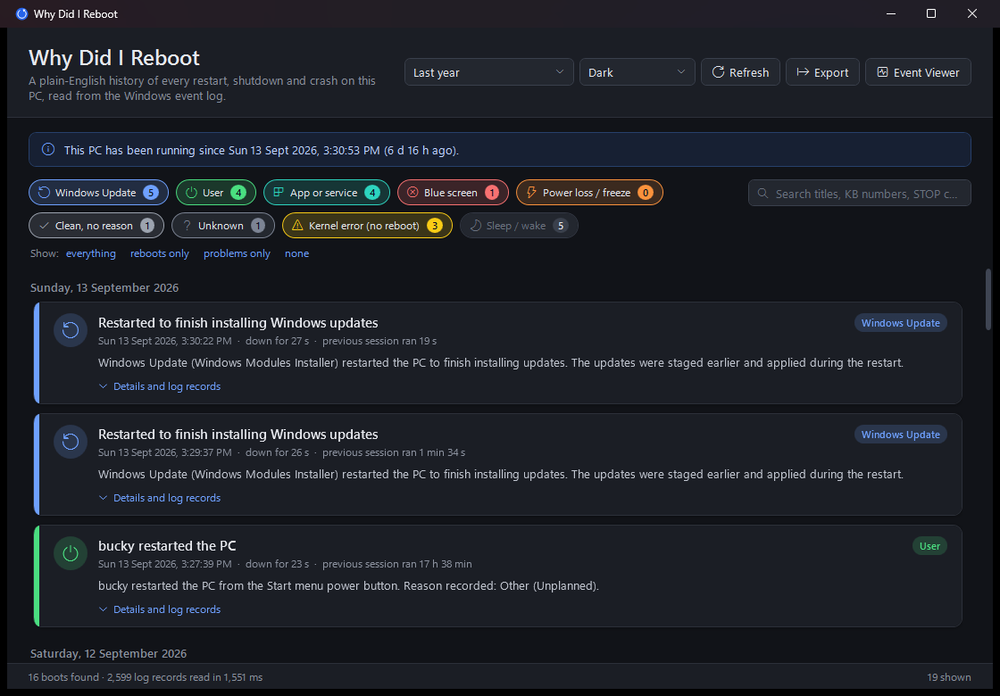
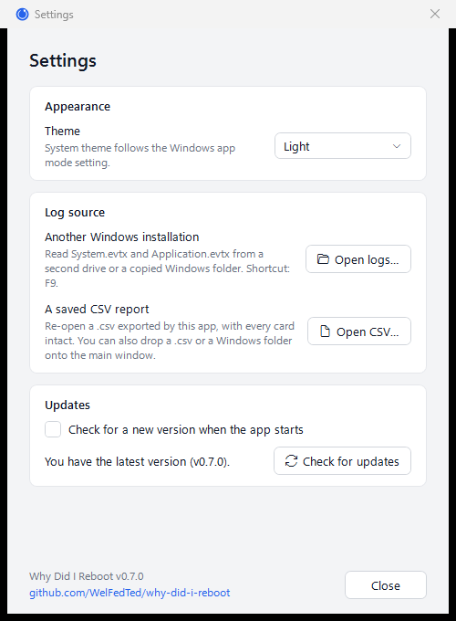

# Why Did I Reboot

[](https://github.com/WelFedTed/why-did-i-reboot/actions/workflows/build.yml)

A small Windows desktop app that answers one question: **why did this PC restart?**

It reads the Windows event log, stitches the shutdown and boot records back together, and shows one plain-English card per reboot: who asked for it, whether it was Windows Update, a blue screen (with the STOP code and dump file), a power cut, a forced power-off, or a sleep/wake cycle that never turned into a reboot at all.

No installer, no admin rights, no telemetry. It only reads the `System` and `Application` logs that every user account can already read.



Dark mode follows the Windows setting, or can be forced from Settings:



Settings (the cog in the header) holds the theme picker, an update check against GitHub Releases, and the version:



## Features

- **One card per reboot**, newest first, grouped by day, with a colour-coded category:
  Windows Update · User · App or service · Blue screen · Power loss / freeze · Clean, no reason · Unknown · Kernel error (no reboot) · Sleep / wake
- **Plain-English summaries** ("Windows Update restarted the PC to finish installing updates. Installed shortly before: KB5043076…"), plus a "Details and log records" expander with the raw evidence for the sceptical.
- **Blue screens decoded**: STOP code, symbolic name (e.g. `DRIVER_POWER_STATE_FAILURE`), a one-line hint about the usual cause, the minidump path, and whether the dump file still exists. Works with or without a dump: a Kernel-Power 41 with a bugcheck code is enough.
- **Unexpected stops explained**: distinguishes a held power button, power lost while asleep, a firmware-reported hardware error, and a plain freeze/reset.
- **Live kernel events** (GPU hangs, resource timeouts) that did *not* reboot the machine, because they often precede the crash that does.
- **Filters**: toggle categories, quick presets (everything / reboots only / problems only / none), free-text search across titles, KB numbers, STOP codes and raw messages, and a date range from 7 days to the whole log.
- **Export** what is shown as a self-contained `.html` report (same cards, category chips, presets and search with highlighting, all working offline; follows the reader's light/dark preference; prints cleanly), a `.txt` report or `.csv`, or copy a single entry to the clipboard. Also works headless from the command line.
- **Light and dark themes**: follows the Windows app theme by default, or pick Light / Dark in Settings (the cog in the header). The choice is remembered in `%LocalAppData%\WhyDidIReboot\settings.json`.
- **Installed updates**: a card lists each update installed shortly before the restart, grouped into Windows, Security, Drivers, Apps and Other, with its short description and classification from Windows Update history, a *failed* marker where installation failed, and a link to the Microsoft Support (KB) article. Blue screen cards link to the Microsoft Learn page for the STOP code.
- **Driver labels**: known driver file names are explained inline, e.g. `nvlddmkm.sys (NVIDIA kernel-mode display driver)`.
- **Debug in WinDbg**: crash cards whose dump file still exists offer to open it in WinDbg with `!analyze -v` queued. If WinDbg isn't installed, the app offers to install it through winget and then opens the dump.
- **Search the web**: a "Search Google" link (or Bing, DuckDuckGo, Brave, Startpage, chosen in Settings) looks up the bugcheck name and code together with any driver names on the card.
- **Ask AI**: runs `!analyze -v` through WinDbg, distils the output (probable cause, module, bucket id, stack), adds the card's text, copies the prompt to the clipboard and opens ChatGPT, Microsoft Copilot, Perplexity or Claude (your choice in Settings) with the prompt prefilled. The analysis is saved, so pressing Ask AI again for the same dump skips WinDbg (hold Shift to re-run it).
- **Right-click any card** for the same actions: copy, open dump folder, debug, search, ask AI.
- **Any period**: last 7 / 30 / 90 days, last year, everything, or a custom from/to range. Headless: `--days N`, `--days all`, or `--from yyyy-MM-dd --to yyyy-MM-dd`.
- **Logs from another Windows installation**: Settings (the cog, or **F9**) → *Open logs…*, then pick a second drive, its Windows folder, or a copied `winevt\Logs` folder. Crash dump paths are checked on that drive. Also `--source <folder>` on the command line, or drop the folder onto the window.
- **Saved reports**: the CSV export keeps every card field, and can be re-opened later from Settings → *Open CSV…*, with `--source report.csv`, or by dropping the file onto the window.
- **Updates**: checks GitHub Releases once at startup (toggle in Settings, on by default) or on demand. When a newer version exists, *Update now* downloads the matching build, verifies the published SHA-256 digest, the executable header and its version, swaps it in beside the running copy and relaunches. Nothing is sent beyond the requests themselves.
- Buttons to jump to Event Viewer or straight to a crash dump in Explorer.

## Build and run

Requires the .NET 8 SDK (or newer) on Windows 10/11.

```bash
dotnet run --project src/WhyDidIReboot
```

To produce a copyable build (needs the .NET 8 Desktop Runtime on the target PC):

```bash
dotnet publish src/WhyDidIReboot -c Release -o dist
```

Or a single self-contained executable that needs nothing installed (downloads the runtime pack from NuGet on first use):

```bash
dotnet publish src/WhyDidIReboot -c Release -r win-x64 --self-contained -p:PublishSingleFile=true -o dist
```

The app icon is generated from `tools/make-icon.ps1`; run it if `src/WhyDidIReboot/Assets/app.ico` is missing.

## Releasing

1. Describe the changes under a new `## [X.Y.Z] - YYYY-MM-DD` heading in [CHANGELOG.md](CHANGELOG.md) (move items out of *Unreleased*).
2. Set `<Version>` in `src/WhyDidIReboot/WhyDidIReboot.csproj` and the manifest version in `app.manifest`.
3. Commit, then tag and push: `git tag -a vX.Y.Z -m "Why Did I Reboot X.Y.Z" && git push origin vX.Y.Z`.

The workflow builds both flavours, copies that changelog section into the GitHub Release notes, and attaches the binaries. It fails if the changelog has no section for the tag.

## Command-line export

```bash
WhyDidIReboot.exe --export report.html --days 90
WhyDidIReboot.exe --export report.csv --days all --sleep
```

The extension picks the format: `.html`, `.txt` or `.csv`. `--days` defaults to 365; `all` reads the entire log. `--sleep` includes sleep/wake cycles, which are hidden by default.

## How it decides

Windows never writes a single "reason for reboot" record. The app reads these events and correlates them per boot:

| Log | Provider | Event | Meaning |
|---|---|---|---|
| System | Kernel-General | 12 / 13 | OS started / OS shutting down (the boot and shutdown markers) |
| System | Kernel-Boot | 27 | Boot type: cold boot, fast startup (hybrid), or resume from hibernation |
| System | User32 | 1074 | Who requested the shutdown, why, and whether it was a restart or power off |
| System | User32 | 1076 | Reason a user typed in after an unexpected shutdown |
| System | Kernel-Power | 41 | Rebooted without a clean shutdown; carries the bugcheck code and power-button flags |
| System | WER-SystemErrorReporting | 1001 | "The computer has rebooted from a bugcheck": STOP code and minidump path |
| System | EventLog | 6005 / 6006 / 6008 | Log service started / stopped / previous shutdown was unexpected |
| System | Kernel-Power | 109 | Kernel initiated a shutdown transition |
| System | WindowsUpdateClient | 19 / 20 | Update installed / failed shortly before the shutdown (Store app updates are ignored) |
| System | Kernel-Power / Power-Troubleshooter | 42 / 1 | Went to sleep / woke up, with the wake source |
| Application | Windows Error Reporting | 1001 | `BlueScreen` reports (linked by report ID) and `LiveKernelEvent` reports |

For every boot marker it looks back at what ended the previous session and forward at what Windows wrote in the first minutes after starting:

1. A Kernel-Power 41 or EventLog 6008 after the boot means the previous session did not shut down cleanly. A non-zero bugcheck code, or a bugcheck 1001 record, makes it a **blue screen**; otherwise it is a **power loss / freeze**, refined by the power-button and sleep flags in the 41 record.
2. Otherwise the last User32 1074 before the shutdown names the requester. Windows Update processes (TrustedInstaller, MoUsoCoreWorker, UsoClient, SetupHost…) or an "Upgrade" reason make it **Windows Update**; Explorer, the sign-in screen, Settings or a `shutdown` command run by a person make it **User**; anything else is **App or service**.
3. A clean shutdown marker with no 1074 is **Clean, no reason**.
4. Nothing at all is **Unknown**.

## Tests

The analyzer is a pure function over a list of event records, so the tests build synthetic Windows events (shaped like the real ones) and check the category, title, summary, timings and evidence that come out. Exporters and the bugcheck catalog are covered too.

```bash
dotnet test
```

## Project layout

```
src/WhyDidIReboot/
  Core/            event log reader, analyzer, bugcheck catalog, exporters (no UI dependencies)
  MainWindow.xaml  the timeline UI
  MainViewModel.cs filters, search, commands
  ThemeManager.cs  light/dark switching and the persisted preference
tests/WhyDidIReboot.Tests/
  Events.cs        builders for synthetic event records
  *Tests.cs        xUnit tests for the analyzer, exporters and catalog
tools/make-icon.ps1
```
